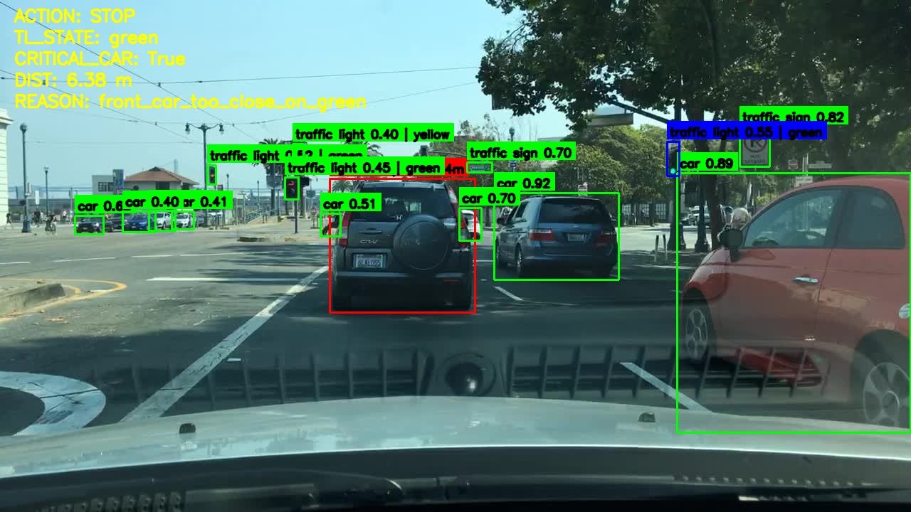
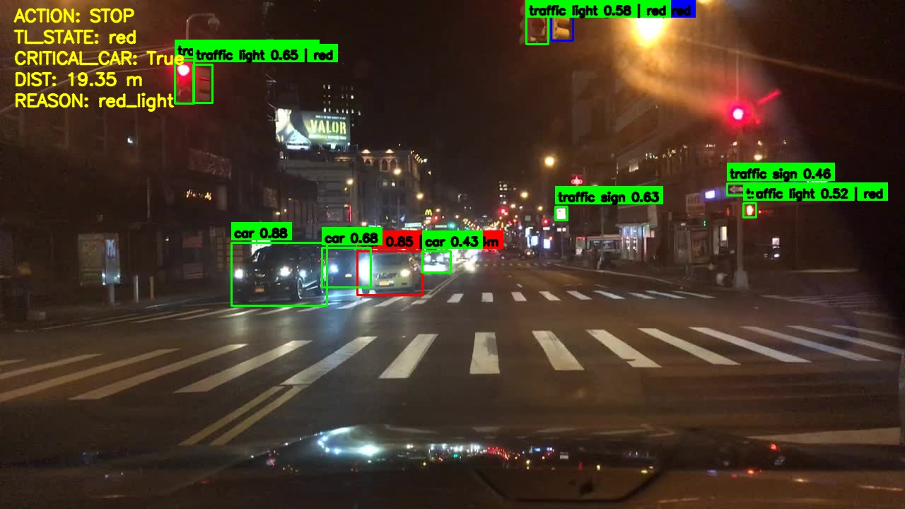
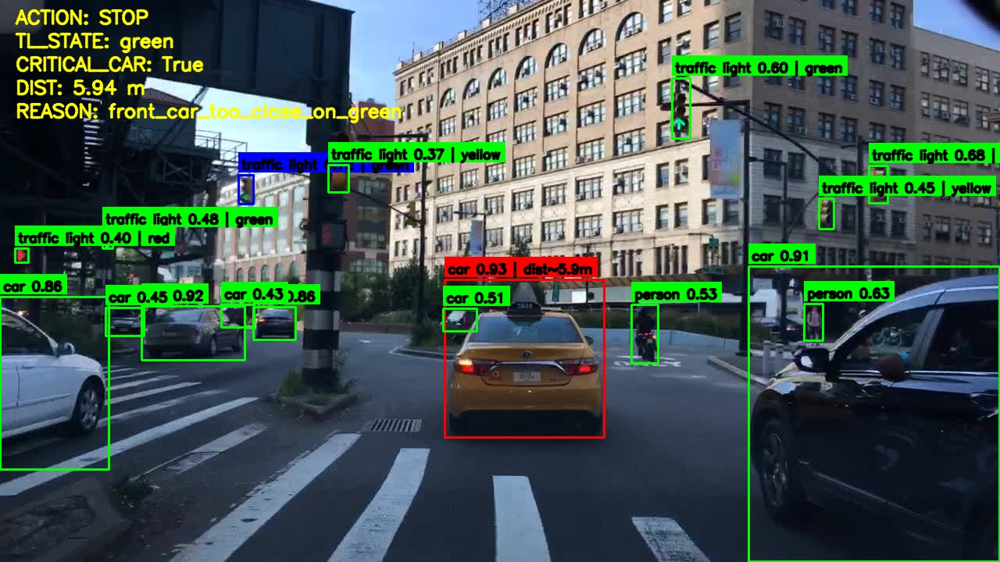
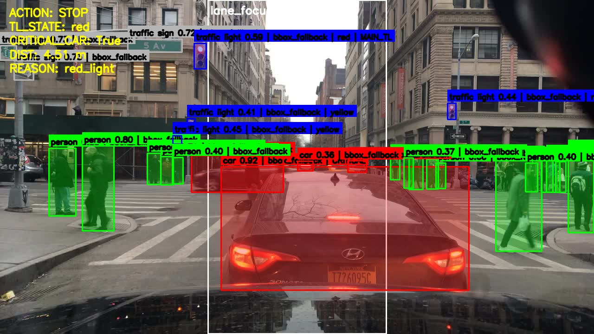
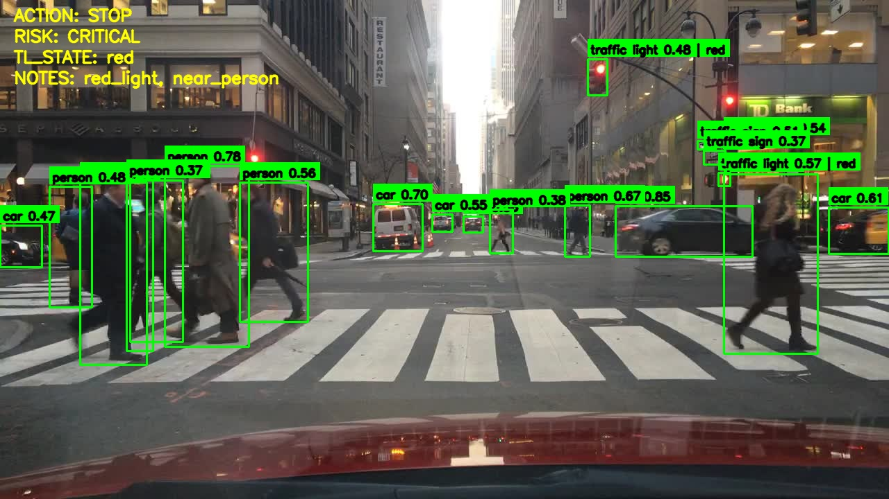
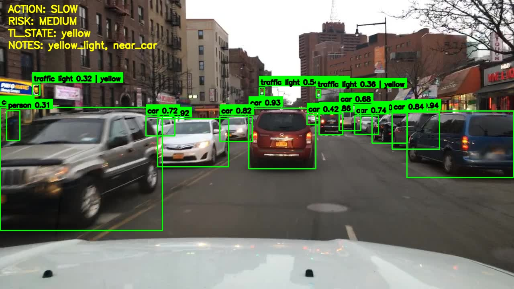

# 🚗 Autonomous Driving Perception & Decision System (ADAS)

Bu proje, bilgisayarlı görü ve yapay zekâ tekniklerini kullanarak yol sahnesini algılayan, bu sahneyi analiz eden ve elde edilen bilgiler doğrultusunda sürüş kararları üreten modüler bir ADAS (Advanced Driver Assistance System) sistemi geliştirmeyi amaçlamaktadır.

---

## 📌 Proje Özeti

Bu sistem, klasik bir nesne tespit yaklaşımının ötesine geçmektedir.
Amaç yalnızca sahnedeki nesneleri algılamak değil, bu sahneyi bağlamı ile birlikte yorumlayarak anlamlı ve uygulanabilir sürüş kararları üretmektir.

Sistem aşağıdaki çok aşamalı bir yapı ile çalışır:
Perception → Scene Understanding → Decision

Bu yapı sayesinde sistem, algıladığı çevresel bilgileri analiz ederek aşağıdaki aksiyonları üretir:

- STOP (dur)
- SLOW (yavaşla)
- GO (devam et)
- WARNING (risk uyarısı)

---

## ⚙️ Teknik Özellikler

- **YOLO tabanlı nesne tespiti:**  
  Görüntü üzerinde gerçek zamanlı olarak araç, yaya ve trafik ışığı gibi kritik nesnelerin tespiti gerçekleştirilir. Her nesne için bounding box koordinatları ve güven skorları (confidence) üretilir.

- **Trafik ışığı durum analizi:**  
  Tespit edilen trafik ışıkları üzerinden renk tabanlı sınıflandırma (red / yellow / green) yapılarak sahneye ait semantik bilgi elde edilir ve karar mekanizmasına aktarılır.

- **Ön araç mesafe ve risk analizi:**  
  Araç bounding box’ları kullanılarak göreli mesafe tahmini yapılır. Bu mesafe bilgisi üzerinden risk seviyesi (low / medium / high / critical) hesaplanır.

- **Şerit (lane) tespiti:**  
  Görüntü işleme yöntemleri ile yol üzerindeki şerit çizgileri belirlenir ve aracın şerit içindeki konumu analiz edilir.

- **Kural tabanlı karar mekanizması (Decision Engine):**  
  Algılama ve analiz çıktıları, önceden tanımlanmış kurallar doğrultusunda işlenerek sürüş aksiyonları (STOP, SLOW, GO, WARNING) üretilir.

- **Açıklanabilir çıktı üretimi (Explainable Outputs):**  
  Sistem yalnızca aksiyon üretmekle kalmaz, aynı zamanda kararın nedenini açıklayan yapılandırılmış çıktılar üretir:
  - `ACTION`: Üretilen sürüş aksiyonu
  - `RISK`: Hesaplanan risk seviyesi
  - `REASON`: Kararın dayandığı temel faktörler

- **Debug ve overlay görselleştirme:**  
  Tespit edilen nesneler, karar çıktıları ve sistem içi metrikler görüntü üzerine bindirilerek (overlay) analiz edilebilir görsel çıktılar oluşturulur.

---

## 🧠 Sistem İşleyişi

Sistem, çok aşamalı bir pipeline üzerinden çalışır ve her aşama bir sonraki adıma veri sağlar:

1. **Giriş verisi alınır:**  
   Kamera akışı veya video/görüntü verisi sisteme giriş olarak alınır.

2. **Nesne tespiti (Perception):**  
   YOLO modeli kullanılarak sahnedeki araç, yaya ve trafik ışığı gibi kritik nesneler tespit edilir.

3. **Sahne analizi (Scene Understanding):**  
   Tespit edilen nesneler üzerinden trafik ışığı durumu ve ön araç konumu analiz edilir, sahne bağlamı oluşturulur.

4. **Şerit bilgisi çıkarımı:**  
   Görüntü işleme teknikleri ile yol üzerindeki şeritler belirlenir ve aracın konumu değerlendirilir.

5. **Karar üretimi (Decision Engine):**  
   Elde edilen tüm bilgiler kural tabanlı karar mekanizmasında işlenerek uygun sürüş aksiyonu belirlenir.

6. **Görselleştirme (Output & Debug):**  
   Tespitler, analiz sonuçları ve üretilen kararlar görüntü üzerine bindirilerek kullanıcıya sunulur.

---

## 🎯 Karar Mekanizması

Karar sistemi rule-based çalışır.

Örnek:

| Durum         | Karar       |
| ------------- | ----------- |
| Kırmızı ışık  | STOP        |
| Sarı ışık     | SLOW        |
| Ön araç yakın | SLOW / STOP |
| Yol güvenli   | GO          |

Örnek çıktı:

```
ACTION: STOP
RISK: CRITICAL
REASON: RED_LIGHT
DIST: 12.5m
```

---

## 🖼️ Örnek Çıktılar

<p align="center">
  
  
</p>
<p align="center">
  <em>Ön araç risk analizi ve karar çıktıları</em>
</p>

<p align="center">
  
  
</p>
<p align="center">
  <em>Karar mekanizması ve segmentation/debug görünümü</em>
</p>

<p align="center">
  
  
</p>
<p align="center">
  <em>Notebook üzerinden alınan örnek inference çıktıları</em>
</p>


---

## 📊 Dataset

Bu projede **BDD100K (Berkeley DeepDrive 100K)** veri seti kullanılmıştır.  
BDD100K, otonom sürüş araştırmaları için geliştirilmiş geniş ölçekli bir veri setidir.

### 📌 Kullanım ve Lisans Notu

- **BDD100K veri seti bu repoya dahil değildir.**
- Bu repository içerisinde yer alan görseller, veri setine ait ham görüntüler değil; model tarafından üretilmiş **inference ve debug çıktılarıdır.**
- Veri setine erişim, yalnızca resmi kaynak üzerinden ve ilgili lisans/ kullanım şartları kabul edilerek sağlanmalıdır.

### 🔗 Resmi Kaynak

https://bdd-data.berkeley.edu/

### ⚠️ Önemli

Bu projeyi kullanan kullanıcılar, BDD100K veri setini indirirken ve kullanırken ilgili **lisans ve kullanım koşullarına uymakla sorumludur.**

---

## 🛠️ Kurulum

```bash
git clone https://github.com/huseyin-dgn/Autonomous-Driving-Perception-and-Decision-System.git
cd autonomous_driving
pip install -r requirements.txt
```

---

## 🚀 Kullanım

### Görüntü inference

```bash
python scripts/infer_image.py --input data/sample.jpg --output outputs/predictions/result.jpg
```

### Video inference

```bash
python scripts/video_processor.py
```

---

## 📁 Proje Yapısı

```
autonomous_driving/
│
├── src/            # ana modüler kod
├── scripts/        # çalıştırma scriptleri
├── configs/        # config dosyaları
├── notebooks/      # deney ve analiz
├── outputs/        # model ve sonuçlar
└── main.py
```

---

## 🧪 Eğitim

```bash
python scripts/train_yolo.py
```

Model çıktıları:

```
outputs/models/
```

---

## 🛣️ Lane Analizi

- Şerit çizgileri tespit edilir
- Araç pozisyonu analiz edilir
- Basit steering bilgisi üretilebilir

---

## 🖼️ Çıktılar

- Bounding box + label
- Trafik ışığı durumu
- Ön araç mesafesi
- Risk seviyesi
- Karar çıktısı
- Debug overlay

---

## 🔮 Gelecek Çalışmalar

- Gazebo entegrasyonu
- CARLA simülasyonu
- RL tabanlı karar sistemi
- Multi-camera destek

---

## 📌 Özet

Bu proje, görüntü işleme ile çevreyi algılayıp üzerine karar mekanizması ekleyerek  
**otonom sürüş davranışını simüle eden bir ADAS sistemidir.**
